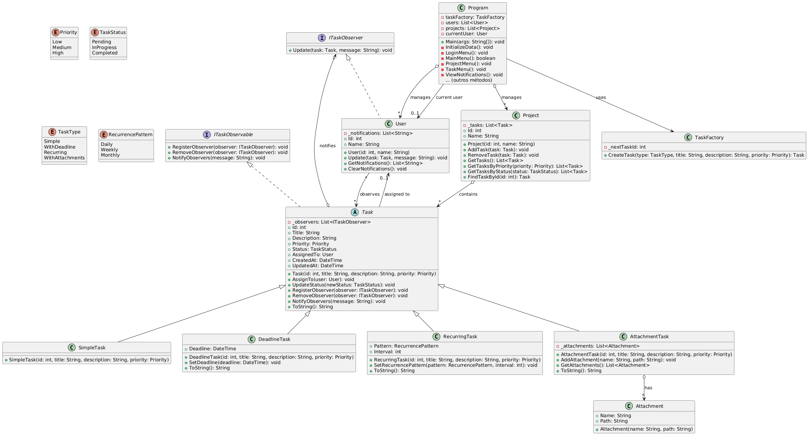

# Sistema de Gerenciamento de Tarefas

Um sistema de gerenciamento de tarefas flexível e escalável desenvolvido em C# usando padrões de projeto para facilitar a criação, acompanhamento e atualização de tarefas por indivíduos e times.

## Vídeo

[Link Youtube.](https://youtu.be/AkD87WrovDs)

https://github.com/user-attachments/assets/317814ae-7066-4d2c-ba1b-224f4e2dd106

## Visão Geral

Este projeto implementa um sistema de gerenciamento de tarefas com as seguintes funcionalidades:
- Criação e gerenciamento de diferentes tipos de tarefas
- Organização de tarefas por projetos, prioridades e status
- Sistema de notificações em tempo real usando o padrão Observer
- Arquitetura flexível para adicionar novos tipos de tarefas usando o padrão Factory Method

## Arquitetura

O sistema foi desenvolvido seguindo princípios de Programação Orientada a Objetos (POO) e utiliza os padrões de projeto Factory Method e Observer para garantir flexibilidade e extensibilidade.

### Diagrama de Classes

<div align="center">
<sub>Figura 1 - Diagrama de Classes</sub><br>
<br>
<sup>Fonte: Material produzido pelos autores (2025) </sup>
</div>


### Componentes Principais

#### Entidades Básicas
- **Task**: Classe abstrata que representa uma tarefa
- **User**: Classe que representa um usuário do sistema
- **Project**: Classe que agrupa tarefas em projetos

#### Tipos de Tarefas
- **SimpleTask**: Tarefa básica
- **DeadlineTask**: Tarefa com prazo de entrega
- **RecurringTask**: Tarefa recorrente (diária, semanal, mensal)
- **AttachmentTask**: Tarefa com anexos

#### Elementos de Apoio
- **TaskFactory**: Fábrica para criar diferentes tipos de tarefas
- **Attachment**: Representa um anexo em uma tarefa
- **Enums**: Definições para status, prioridade e outros atributos

## Padrões de Projeto Implementados

### Factory Method
- **Problema resolvido**: Criar diferentes tipos de tarefas sem acoplar o código cliente às classes concretas
- **Implementação**: Classe `TaskFactory` que cria tarefas baseadas no tipo solicitado

```csharp
public Task CreateTask(TaskType type, string title, string description, Priority priority)
{
    Task task;
    int taskId = _nextTaskId++;
    
    switch (type)
    {
        case TaskType.WithDeadline:
            task = new DeadlineTask(taskId, title, description, priority);
            break;
        // Outros casos...
        default:
            task = new SimpleTask(taskId, title, description, priority);
            break;
    }
    
    return task;
}
```

### Observer
- **Problema resolvido**: Notificar usuários quando ocorrerem mudanças nas tarefas
- **Implementação**: Interfaces `ITaskObserver` e `ITaskObservable` com relação many-to-many

```csharp
// Padrão Observer - Notificando observadores
public void NotifyObservers(string message)
{
    foreach (var observer in _observers)
    {
        observer.Update(this, message);
    }
}

// No lado do observador (usuário)
public void Update(Task task, string message)
{
    _notifications.Add($"[{DateTime.Now}] {message}");
}
```

## Funcionalidades

### Gerenciamento de Usuários
- Login no sistema
- Visualização de notificações
- Gerenciamento de tarefas atribuídas

### Gerenciamento de Projetos
- Criação e listagem de projetos
- Visualização detalhada de projetos
- Adição de tarefas a projetos

### Gerenciamento de Tarefas
- Criação de diferentes tipos de tarefas (simples, com prazo, recorrentes, com anexos)
- Atribuição de tarefas a usuários
- Atualização de status e prioridade
- Filtragem de tarefas por status e prioridade
- Sistema de observadores para notificações

## Como Executar

1. Clone o repositório
2. Abra a solução no Visual Studio ou seu IDE C# preferido
3. Compile e execute o projeto 
```
cd TaskSystem
dotnet run
```
4. Interaja com o sistema através da interface de console:
   - Faça login com um usuário
   - Crie ou selecione projetos
   - Adicione diferentes tipos de tarefas
   - Atualize o status das tarefas
   - Verifique as notificações geradas

## Fluxo de Uso Típico

1. Usuário faz login no sistema
2. Usuário cria um projeto ou seleciona um existente
3. Usuário adiciona tarefas ao projeto
4. Usuário atribui tarefas a si mesmo ou outros usuários
5. Usuário atualiza status das tarefas
6. Observadores recebem notificações das mudanças

## Pontos Fortes da Implementação

- **Extensibilidade**: Fácil adicionar novos tipos de tarefas sem modificar o código existente
- **Coesão**: Classes com responsabilidades bem definidas
- **Baixo Acoplamento**: Uso de interfaces e abstração
- **Notificações em Tempo Real**: Sistema de notificações baseado no padrão Observer
- **Interface Intuitiva**: Menu interativo via console para demonstração das funcionalidades

## Melhorias Futuras

- Interface gráfica (WPF, WinForms ou web)
- Persistência de dados em banco de dados
- Autenticação de usuários
- Grupos de usuários e permissões
- Estatísticas e relatórios
- API REST para integração com outros sistemas

## Desenvolvimento

Este projeto foi desenvolvido como parte de um desafio de programação, focando na aplicação de padrões de design para criar um sistema flexível e escalável. Os padrões utilizados (Factory Method e Observer) permitiram criar uma base sólida que pode ser facilmente estendida para incluir novos tipos de tarefas e funcionalidades.

A implementação atual é uma prova de conceito que demonstra os conceitos principais, com uma interface de console para facilitar a visualização e teste das funcionalidades.
